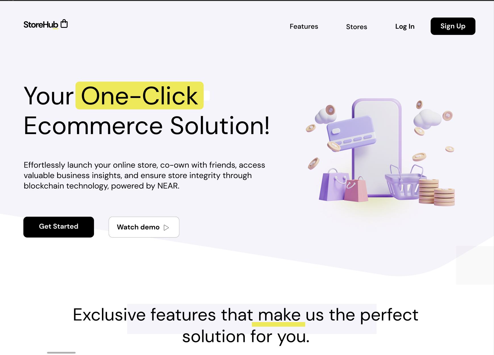

  

# Store Hub — Your Single-Click Ecommerce Solution

Store Hub is a groundbreaking solution for businesses looking to effortlessly establish an online presence. With just a single click, you can launch an e-commerce store, co-own the store with friends, and gain unparalleled business insights and analytics to help your business thrive in the online marketplace. 

Our platform leverages the power of blockchain technology to guarantee the integrity of your online store. We utilize the NEAR blockchain, known for its user-friendly, carbon-neutral, secure, and infinitely scalable characteristics. NEAR provides a foundation for an ecommerce solution that is both performant and secure, ensuring that your business operations are seamless and reliable.

## Features

### 1. Single-Click Store Launch

Store Hub makes starting an online business as easy as clicking a button. You don't need to worry about website hosting, development, or e-commerce features - our platform handles it all. Our hosting package focuses on providing a robust ecommerce solution with site-building features, allowing you to focus on what matters most: your business.

### 2. Store Co-Ownership

Collaborate with friends or business partners seamlessly with our co-ownership feature. Share responsibilities and roles, manage operations together, and enjoy the rewards of shared success.

### 3. Exceptional Business Analytics and Insights

Gain valuable insights into your business operations with our advanced analytics. Track sales, monitor customer behavior, optimize your inventory, and much more. Our comprehensive analytics provide you with the information you need to make data-driven decisions and enhance your business strategy.

### 4. NEAR Blockchain Integration

We're proud to utilize the NEAR blockchain, which provides a secure and scalable foundation for your online store. With NEAR, you can rest assured that the integrity of your store is upheld, protecting both you and your customers.

### 5. Guaranteed Uptime and Speed

We understand that uptime and website responsiveness are crucial for your online store. That's why we strive for 99.99% to 100% uptime, ensuring your store is always available for your customers. Our platform is designed to load quickly, preventing lost sales due to slow site speeds.